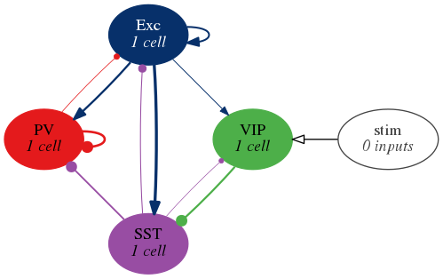
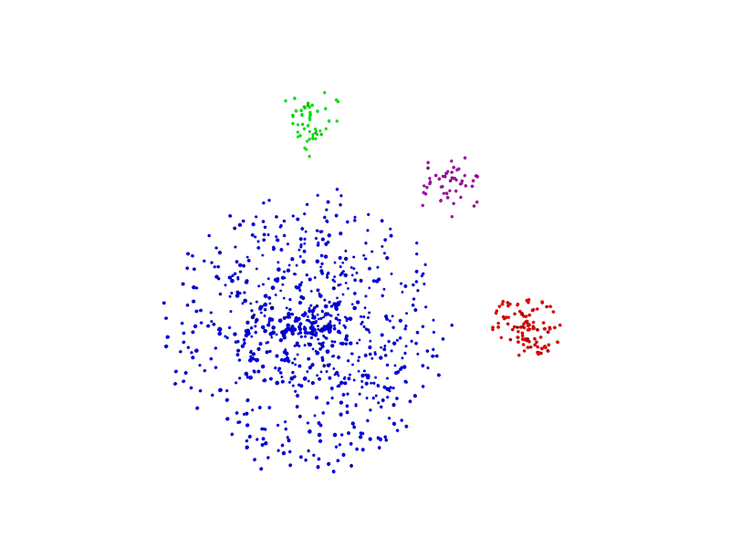

# Garcia del Molino et al. 2017
 

Implementation in NeuroML2/LEMS of Garcia del Molino, L. C., Yang, G. R., Mejias, J.
F., & Wang, X. J. (2017). Paradoxical response reversal of top-down modulation
in cortical circuits with three interneuron types. [eLife, 6,
e29742](https://cdn.elifesciences.org/articles/29742/elife-29742-v2.pdf).

## The model

    
    

The model simulates the dynamics of Pyramidal cells (E)
with three interneurons types (parvalbumin (PV), somatostatin (SST) and
vasoactive intestinal peptide (VIP)). With this model, the authors provide
answers to two counterintuitive phenomena: (I) the external activation of a
population that inhibits a second population can trigger a positive response in
the latter; (II) depending on the sensory input a top-down modulation can
trigger both a positive and a negative response.

The authors first look at the interaction between single units (image on the left)
and then scale up the model to analyse
the interaction of a network of multiple interacting units in each population
(image on the right).

## NeuroML version of the model
<!-- We simulated the population firing rate for a low baseline and high baseline -->
<!-- activity. -->
<!-- More details of how these plots were obtained can be found -->
A reproduction of the main findings of the paper using the NeuroML code can be
found
[here](https://github.com/OpenSourceBrain/del-Molino2017/blob/development/notebooks/delMolino2017.ipynb).

## Requirements
The required Python packages and their versions are specified on the
`requirement.txt` file.

Note: Some of the simulations require the NEURON simulator. To
download it see [here](https://www.neuron.yale.edu/neuron/download).

